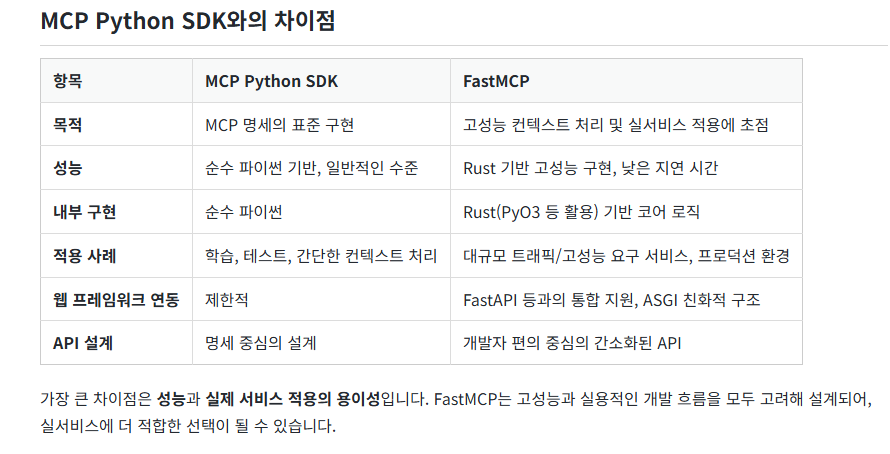

# MCP Server 개발

이 프로젝트는 FastMCP 프레임워크를 사용하여 다양한 기능을 제공하는 MCP(Model Context Protocol) 서버들을 구현한 학습용 예제입니다.

## 프로젝트 구조

```
mcp_study/
├── mcp_manager.py          # MCP 서버 관리 API (FastAPI)
├── mcp_server/             # MCP 서버 모듈들
│   ├── calculator.py       # 계산기 서버 (도구 + 리소스)
│   ├── library.py         # 도서 검색 서버
│   ├── news.py            # 뉴스 검색 서버  
│   └── text_processor.py  # 텍스트 처리 프롬프트 서버
├── requirements.txt        # 의존성 패키지 목록
└── README.md              # 프로젝트 문서
```

## Framework 

FastMCP vs MCP Python SDK



출처: [https://wikidocs.net/287360](https://wikidocs.net/287360)

## Protocol

(1) STDIO

서버와 클라이언트가 같은 시스템 내에서 표준 입출력 파이프(STDIO)를 통해 통신합니다. Claude Desktop, 로컬 도구, 로컬 테스트 환경 등에 적합합니다.

```python
from fastmcp import FastMCP

mcp = FastMCP()

if __name__ == "__main__":
    mcp.run(transport="stdio")
```

(2) Streamable HTTP

HTTP 프로토콜을 기반으로 MCP 서버를 실행하는 방식입니다. 웹 기반 배포에 가장 적합하며, 공식 문서에서도 사용을 권장합니다.

```python
from fastmcp import FastMCP

mcp = FastMCP()

if __name__ == "__main__":
    mcp.run(transport="streamable-http")
```

(3) SSE

SSE(Server-Sent Events)는 HTTP 기반의 스트리밍 프로토콜로, 서버가 클라이언트로 데이터를 지속적으로 전송할 수 있도록 설계되었습니다.

```python
from fastmcp import FastMCP

mcp = FastMCP()

if __name__ == "__main__":
    mcp.run(transport="sse")
```

---

## 소스 코드 파일별 역할 상세 설명

### 1. `mcp_manager.py` - MCP 서버 관리 API

**역할**: FastAPI 기반 MCP 서버 관리 및 모니터링 API

**주요 기능**:
- 여러 MCP 서버들의 상태 모니터링 (ping 기능)
- 각 서버가 제공하는 도구(tool) 목록 조회
- 여러 서버를 병렬로 조회하는 배치 API
- 서버 연결 상태 확인 및 오류 처리

**API 엔드포인트**:
- `GET /status?server_name={name}`: 특정 서버 상태 확인
- `GET /tools?server_name={name}`: 특정 서버의 도구 목록 조회
- `GET /tools/batch?server_names={names}`: 여러 서버 도구 목록 병렬 조회

**실행 포트**: 8080
```bash
uvicorn mcp_manager:app --host 0.0.0.0 --port 8080 --reload
```

**구현 특징**:
- FastMCP Client를 사용한 비동기 서버 통신
- 타임아웃 처리 및 예외 처리
- 서버별 URL 매핑 관리

---

### 2. `mcp_server/calculator.py` - 계산기 MCP 서버

**역할**: 기본적인 수학 연산 도구와 구구단 리소스를 제공하는 MCP 서버

**제공 도구(Tools)**:
- `add(a, b)`: 두 정수 덧셈
- `subtract(a, b)`: 두 정수 뺄셈
- `multiply(a, b)`: 두 정수 곱셈
- `divide(a, b)`: 두 정수 나눗셈 (0으로 나누기 예외 처리)

**제공 리소스(Resources)**:
- `data://gugudan`: 2단~9단 구구단 JSON 데이터

**실행 포트**: 8081 (SSE 프로토콜)
```bash
fastmcp run calculator.py:mcp --transport sse --port 8081 --host localhost
```

**구현 특징**:
- `@mcp.tool()` 데코레이터를 사용한 도구 정의
- `@mcp.resource()` 데코레이터를 사용한 리소스 정의
- 타입 힌트를 활용한 파라미터 검증

---

### 3. `mcp_server/library.py` - 도서 검색 MCP 서버

**역할**: 도서 데이터베이스 검색 기능을 제공하는 MCP 서버

**내장 데이터**:
- 5개의 샘플 도서 정보 (제목, 저자, 출간연도, 내용)
- IT/프로그래밍 관련 도서들로 구성

**제공 도구(Tools)**:
- `search_by_title(query)`: 제목으로 도서 검색 (부분 일치)
- `search_by_author(query)`: 저자명으로 도서 검색 (정확 일치)
- `search_by_year(year)`: 출간연도로 도서 검색

**실행 포트**: 8082 (SSE 프로토콜)
```bash
fastmcp run library.py:mcp --transport sse --port 8082 --host localhost
```

**구현 특징**:
- 리스트 컴프리헨션을 사용한 효율적인 검색
- 대소문자 구분 없는 제목 검색
- 검색 결과가 없을 때의 친절한 메시지

---

### 4. `mcp_server/news.py` - 뉴스 검색 MCP 서버

**역할**: 뉴스 데이터베이스 검색 및 필터링 기능을 제공하는 MCP 서버

**내장 데이터**:
- 5개의 샘플 뉴스 기사 (IT, 경제, 사회 카테고리)
- 제목, 카테고리, 날짜, 내용 정보 포함

**제공 도구(Tools)**:
- `search_by_category(category)`: 카테고리별 뉴스 검색 (IT, 경제, 사회)
- `search_since_date(start_date)`: 특정 날짜 이후의 뉴스 검색

**실행 포트**: 8083 (SSE 프로토콜)
```bash
fastmcp run news.py:mcp --transport sse --port 8083 --host localhost
```

**구현 특징**:
- ISO 날짜 형식 (YYYY-MM-DD) 검증 및 파싱
- 날짜 비교를 통한 필터링
- 입력 데이터 검증 및 오류 메시지

---

### 5. `mcp_server/text_processor.py` - 텍스트 처리 프롬프트 서버

**역할**: LLM을 위한 텍스트 처리 프롬프트를 생성하는 MCP 서버

**제공 프롬프트(Prompts)**:
- `summarize`: 텍스트 요약 프롬프트 생성
  - 시스템 메시지: 요약 전문가 역할 정의
  - 사용자 메시지: 3줄 요약 요청
- `translate_to_korean`: 한국어 번역 프롬프트 생성
  - 시스템 메시지: 전문 번역가 역할 정의
  - 사용자 메시지: 영어→한국어 번역 요청

**실행 포트**: 8084 (SSE 프로토콜)
```bash
fastmcp run text_processor.py:mcp --transport sse --port 8084 --host localhost
```

**구현 특징**:
- `@mcp.prompt()` 데코레이터를 사용한 프롬프트 정의
- 비동기 함수로 구현
- ChatML 형식의 메시지 구조 반환
- 시스템과 사용자 역할 분리

---

## 설치 및 실행 방법

### 1. 의존성 설치
```bash
pip install -r requirements.txt
```

### 2. 각 MCP 서버 실행 (별도 터미널에서)
```bash
# 계산기 서버
fastmcp run mcp_server/calculator.py:mcp --transport sse --port 8081 --host localhost

# 도서 검색 서버
fastmcp run mcp_server/library.py:mcp --transport sse --port 8082 --host localhost

# 뉴스 검색 서버
fastmcp run mcp_server/news.py:mcp --transport sse --port 8083 --host localhost

# 텍스트 처리 서버
fastmcp run mcp_server/text_processor.py:mcp --transport sse --port 8084 --host localhost
```

### 3. 관리 API 서버 실행
```bash
uvicorn mcp_manager:app --host 0.0.0.0 --port 8080 --reload
```

### 4. API 테스트
```bash
# 서버 상태 확인
curl "http://localhost:8080/status?server_name=calculator"

# 도구 목록 조회
curl "http://localhost:8080/tools?server_name=library"

# 여러 서버 배치 조회
curl "http://localhost:8080/tools/batch?server_names=calculator&server_names=news"
```

## 기술 스택

- **FastMCP**: MCP 서버 구현 프레임워크
- **FastAPI**: REST API 서버 (관리 API용)
- **Python 3.11+**: 개발 언어
- **SSE (Server-Sent Events)**: 실시간 통신 프로토콜
- **Uvicorn**: ASGI 웹 서버
- **Asyncio**: 비동기 처리

## 참고 자료

### MCP 개념 및 이론

**유튜브 강의**
- [MCP 기본 개념 소개](https://www.youtube.com/watch?v=-b0IEN4JAGE)
- [JSON/HTTP 기반 SSE 통신](https://www.youtube.com/watch?v=nyZnrKVaIXU)
- [MCP 비유](https://www.youtube.com/watch?v=KZwV6dOfNuE)

**주요 특징**:
- JSON/HTTP 기반 SSE (Server-Sent Events) 프로토콜
- 클라이언트 ↔ 서버 양방향 요청 가능
- MCP Client SDK: `langchain_mcp_adapters`
- MCP Server SDK: `Anthropic MCP SDK`, `FastMCP`

### 실습 예제 및 가이드

**위키독스 튜토리얼**
- [LangChain MCP Server 구현 가이드](https://apidog.com/kr/blog/langchain-mcp-server-kr/)
- [MCP 서버 개발 기초](https://wikidocs.net/268823)
- [MCP 고급 활용법](https://wikidocs.net/288584)
- [MCP 실전 프로젝트](https://wikidocs.net/288137)

### MCP Tool LLM 주입

**Tool 주입 및 확장**
- [MCP Tool 주입 방법](https://wikidocs.net/287840)
